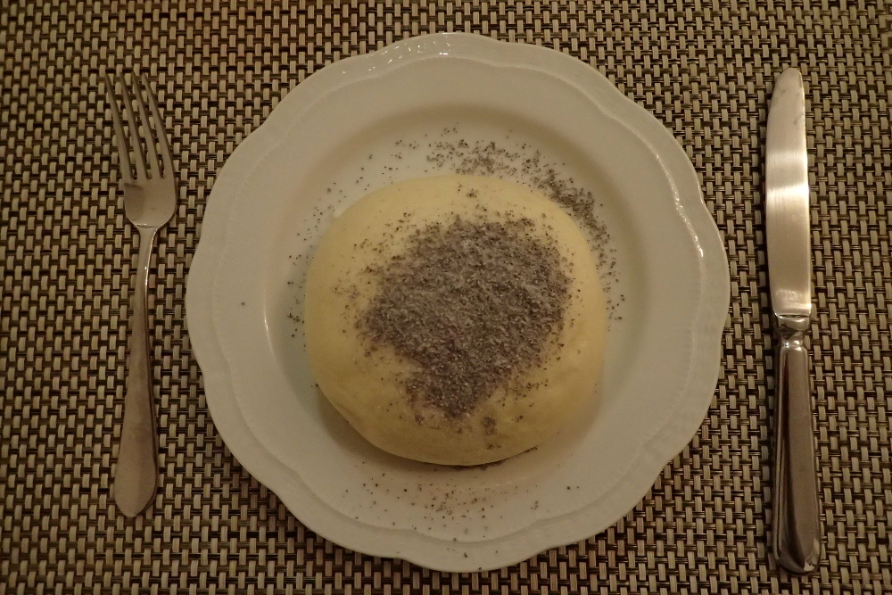

# Germknoedel

* 250g Mehl
* 30g Butter
* 30g Staubzucker
* 15g Germ
* 1 Prise Salz
* 1 Ei
* 125ml Milch
* Powidl

Aus ein bisschen Milch, Mehl, Zucker und der Germ ein Dampfl machen,
alle Zutaten 10min zu einem glatten Teig verkneten. Eine Stunde rasten lassen.
Den Teig in 3-4 Teile aufteilen, kneten bis die Teiglinge schön spannung haben,
mit Powidl füllen und nochmal 30min gehen lassen. Über Dampf 10min garen.

|  |
|:---:|
| *Germknoedel Wien, 20.1.2018* |

