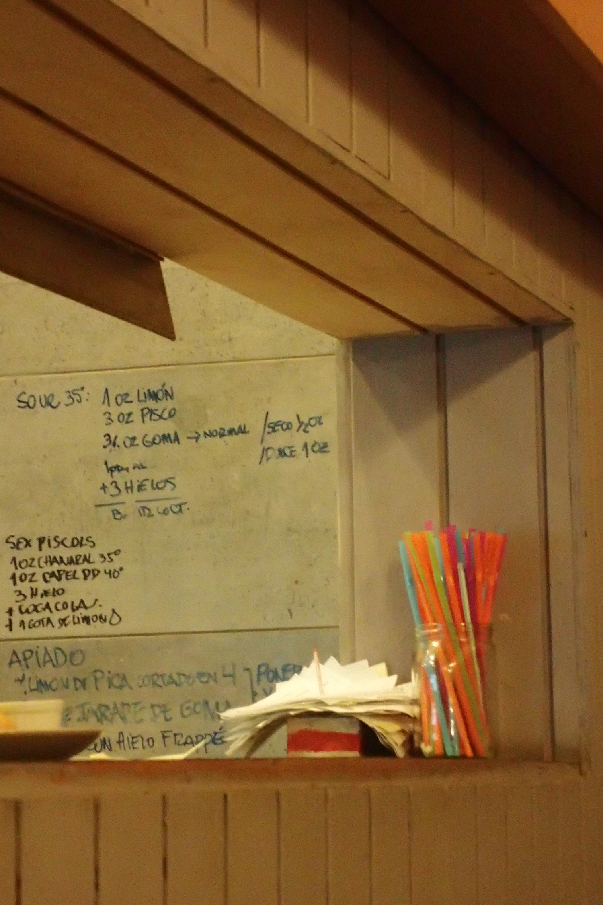

# Pisco Sour

*1 oz &asymp; 3 cl*

* 3 cl Zitronensaft
* 9 cl Pisco
* Jarabe de Goma (Zuckersirup?)
  - normal: 2 cl (?)
  - trocken (?): 1,5 cl
  - süß: 3 cl
* 1 Eiweiß (??)
* 3 Eiswürfel

for reference: Originarezept aus dem Cafe Vinilo, Valparaiso

