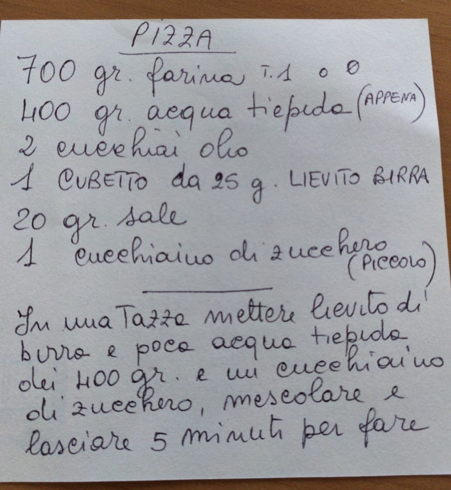
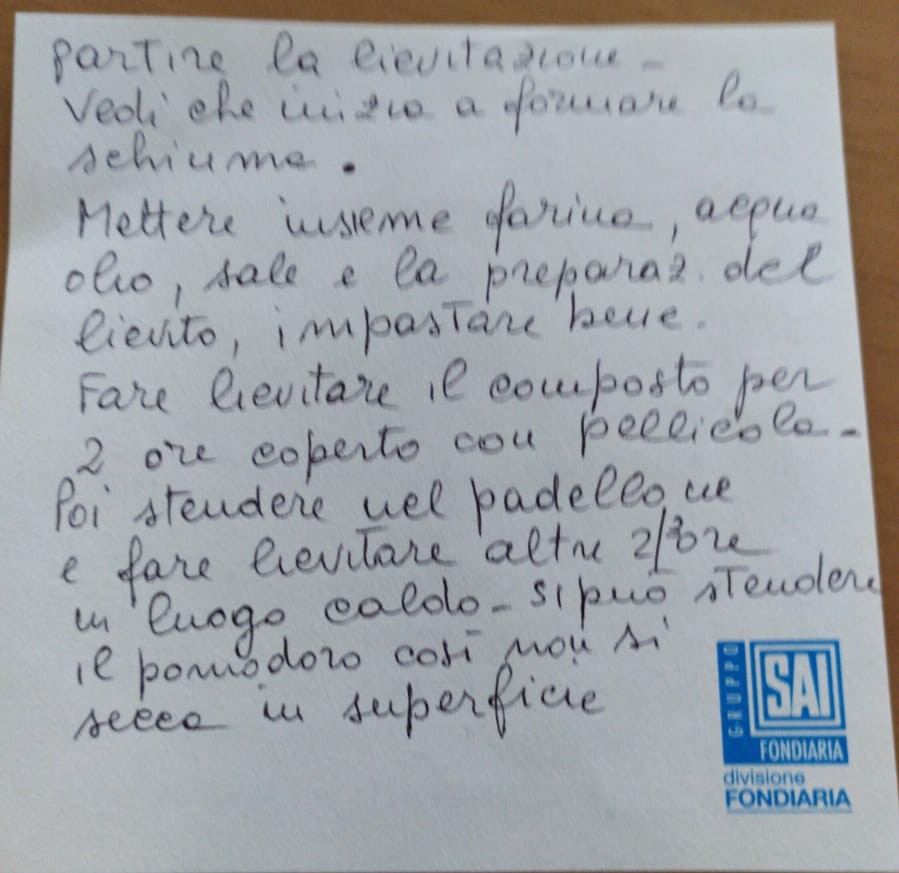

# Pizza degli Angeli
*&copy; Mara degli Angeli*

## Deutsche Übersetzung

* 700 gr. Mehl Typ 1
* 400 gr. lauwarmes Wasser (gerade lauwarm)
* 2 Esslöffel Öl
* 1 Würfel von 25 gr. Bierhefe (Germ)
* 20 gr. Salz
* 1 TL Zucker

1. Die Germ in eine Tasse geben und mit etwas lauwarmen Wasser der 400 ml und einem Teelöffel Zucker verrühren und 5 Minuten stehen lassen, damit die Germ zu gehen beginnt - Man sieht, dass sich Schaum bildet
2. Mehl, Wasser, Öl, Salz und die vorbereitete Germ mischen und gut durchkneten.
3. Die Mischung 2 Stunden zugedeckt mit Folie gehen lassen.
4. Dann auf dem Backblech ausbreiten und an einem warmen Ort nochmals 2 Stunden gehen lassen.
5. Die Tomaten können dabei schon auf dem Teig verteilt werden damit die Oberfläche nicht austrocknet. 

|**_ANMERKUNG&nbsp;1:_** | Die Pizza geht im Warmen an einem Nachmittag oder alternativ in der Früh für den Abend zubereitet im Ofen nur mit Licht (damit keine Luft dazu kommt) auf.|
|**_ANMERKUNG&nbsp;2:_** | Wenn am Blech zubereitet ist sie bei 230 Grad in etwa nach einer Viertelstunde fertig (hängt vom Ofen ab). Es muss sehr heiß sein, und nicht mit Umluft, sonst brennt der Mozzarella an.|

## Italienischer Originaltext

{: height="300px"}
{: height="300px"}

|**_NOTA&nbsp;1:_** | Questa lievita al caldo in un pomeriggio o dal mattino se si fa alla sera si può mettere nel forno solo con luce, per non fare prendere aria.|
|**_NOTA&nbsp;2:_** | Per la cottura se la fate nel padellone in forno, 230 gradi circa un quarto d'ora dipende dal forno, deve essere molto caldo, non ventilato altrimenti cuoce modlto la mozzarella.|

