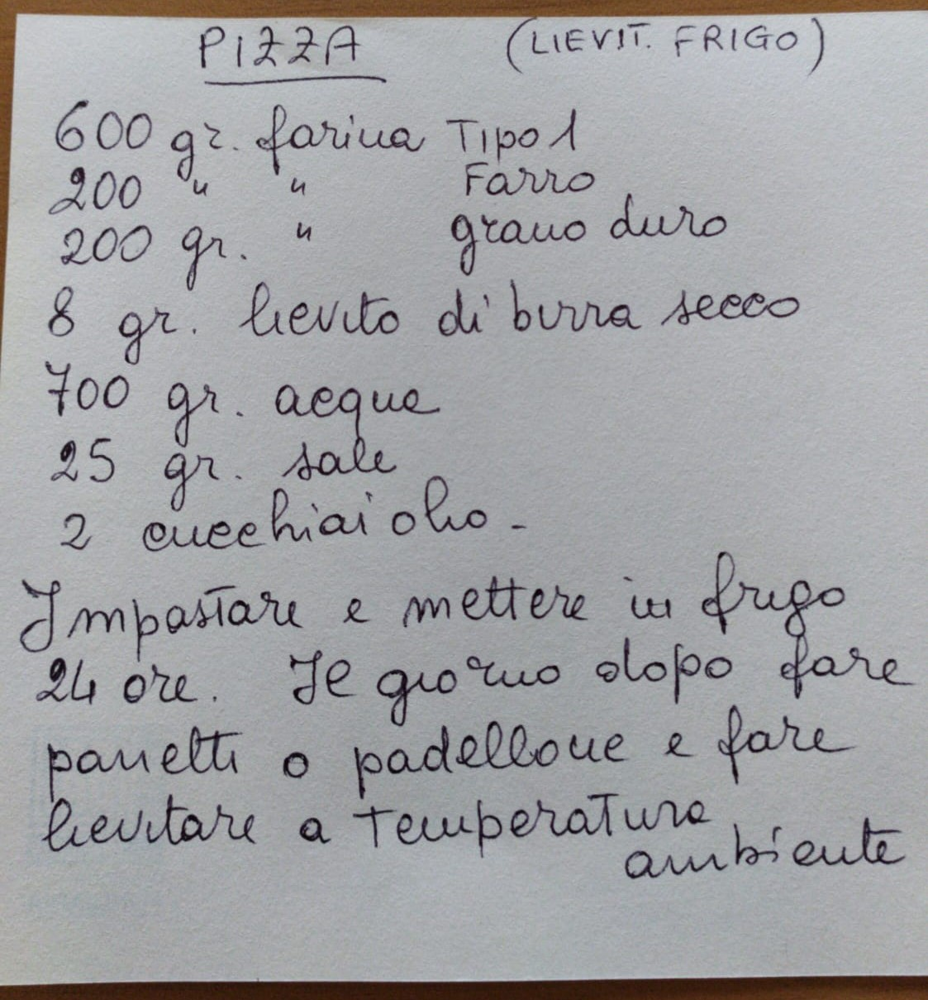

# Pizza degli Angeli (lievitata in frigo)

## Deutsche Übersetzung

* 600 gr. Mehl Typ 1
* 200 gr. Mehl Farro (z.B. Dinkel oder Emmer)
* 200 gr. Hartweizenmehl
* 700 ml  Wasser
* 8 gr. Trockenhefe
* 25 gr. Salz
* 2 EL Öl

1. Alles zusammenmischen und gut kneten. Dann 24 Stunden im Kühlschrank rasten lassen
2. Am nächsten Tag Teiglinge machen oder auf dem Blech ausbreiten und bei Raumtemperatur gehen lassen. 

|**_ANMERKUNG&nbsp;1:_** | Wenn am Blech zubereitet ist sie bei 230 Grad in etwa nach einer Viertelstunde fertig (hängt vom Ofen ab). Es muss sehr heiß sein, und nicht mit Umluft, sonst brennt der Mozzarella an.|

## Italienischer Originaltext

{: height="300px"}

|**_NOTA&nbsp;1:_** | Per la cottura se la fate nel padellone in forno, 230 gradi circa un quarto d'ora dipende dal forno, deve essere molto caldo, non ventilato altrimenti cuoce modlto la mozzarella.|

